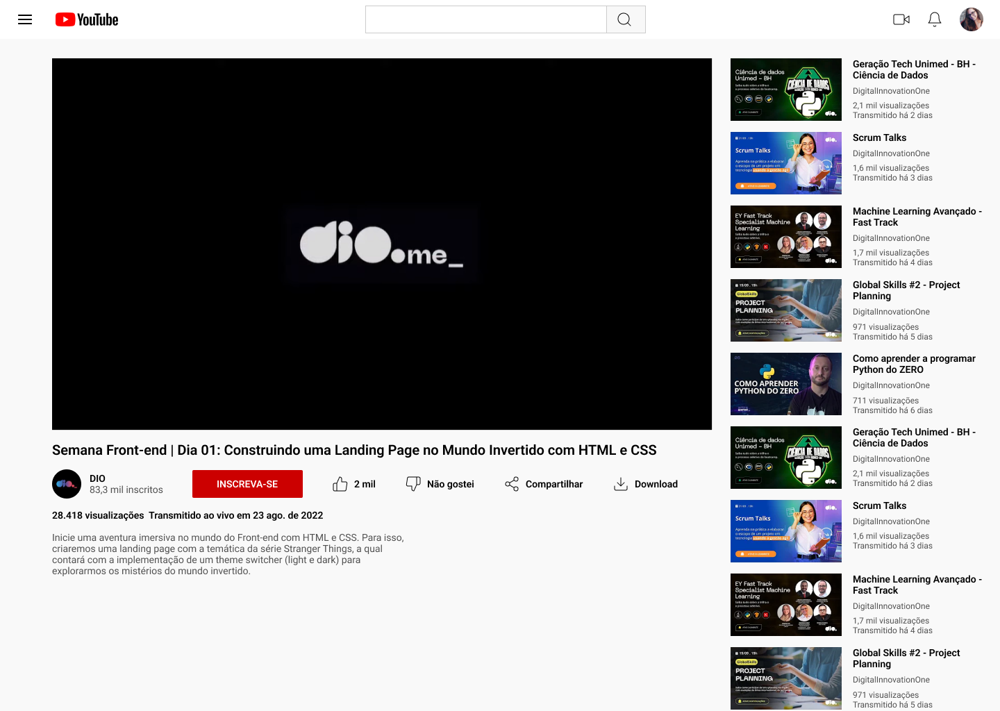

<h1 align="center">Desafio de projeto: Clonando a página do YouTube com CSS. </h1>

    <b>PROJETO</b>: Neste Desafio vamos colocar a mão na massa e  clonar a página do YouTube com CSS colocando em prática todos os conceitos aprendidos, principalmente sobre Flexbox. 

<h1 align="center">
   YouTube - assistindo Vídeo
</h1>

 

  <a href="#-tecnologias">Tecnologia</a>&nbsp;&nbsp;&nbsp;|&nbsp;&nbsp;&nbsp;
  <a href="#-projeto">Projeto</a>&nbsp;&nbsp;&nbsp;|&nbsp;&nbsp;&nbsp;

  

## 🚀 Tecnologias

Esse projeto foi desenvolvido com as seguintes tecnologias:

- HTML
- CSS
- Git e Github

## 💻 Projeto

Desafio de Projeto DIO: construir uma página clone do Youtube, colocando em prática os fundamentos do CSS, com ênfase no Flexbox.

---

Feito com ♥ by Antonio Pereira